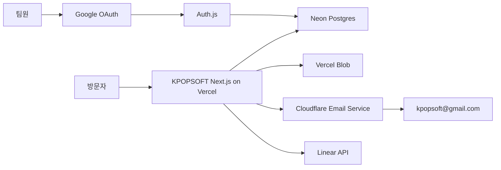

# KPOPSOFT Vercel 관리자 플랫폼 설계

- 작성일: 2026-07-13
- 대상 저장소: `kpopsoft-collab/KPOPSOFT_01`
- 작업 브랜치: `codex/kpopsoft-maxonomy-concept-wind`
- 대상 배포: `https://kpopsoft-02.vercel.app`
- 상태: 사용자 설계 승인 완료, 구현 계획 작성 전

## 1. 목표

KPOPSOFT 공개 홈페이지와 관리자 페이지를 하나의 Next.js 애플리케이션으로 운영한다. 기존 Supabase 의존성을 제거하고, Vercel에서 배포되는 서버 기능과 Vercel Marketplace의 Neon, Vercel Blob을 사용한다.

관리자 인증은 기존 `kpopsoft-hub` 팀원 목록을 최초 이전한 뒤 Google OAuth와 Neon의 관리자 목록으로 독립 운영한다. 모든 등록 팀원은 동일한 최고관리자 권한을 가진다.

문의·교육 요청은 반드시 Neon에 먼저 보존하고, Cloudflare Email Service 알림과 Linear 이슈 생성을 후속 작업으로 처리한다. 외부 연동 실패가 접수 데이터 손실로 이어지지 않아야 한다.

## 2. 범위

### 포함

- Google OAuth 기반 관리자 로그인
- 기존 허브 팀원 목록의 최초 이전
- 등록 팀원 전원 최고관리자 권한
- 문의·교육 요청 접수와 상태·메모·검색·삭제 관리
- 문의 유형·세부 유형 관리
- 프로젝트, 인사이트, 후기, 강사, 통계 콘텐츠 관리
- Vercel Blob 이미지 업로드와 교체
- Cloudflare Email Service를 이용한 관리자 알림
- Cloudflare Email Routing을 이용한 도메인 메일 수신
- Linear 이슈 자동 생성과 재시도
- 관리자·콘텐츠 변경 이력
- 공개 화면과 관리자 화면의 모바일 대응

### 제외 및 후속 작업

- 교육 신청 전용 템플릿 개편
- 방문자에게 보내는 자동 접수 확인 메일
- `kpopsoft-hub`와의 실시간 멤버 동기화
- 세분화된 관리자 역할
- Vercel 유료 플랜 전환

교육 신청 템플릿은 현재 문의 옵션 구조를 유지하고, 별도 후속 이슈에서 수정한다.

## 3. 운영 구조

- 공개 홈페이지와 `/admin`은 같은 Next.js 앱에서 제공한다.
- DB 접근, 메일 발송, Linear 생성, Blob 업로드 토큰 발급은 서버에서만 수행한다.
- 브라우저에는 DB 접속 문자열, Cloudflare 토큰, Linear 토큰을 노출하지 않는다.
- KPOPSOFT 앱은 실행 중 `kpopsoft-hub` 또는 Supabase에 연결하지 않는다.

## 4. 관리자 인증과 권한

### 인증 방식

- Auth.js의 Google Provider와 JWT 세션 방식을 사용한다.
- Google이 확인한 이메일을 소문자로 정규화한 뒤 Neon의 `admin_users`와 대조한다.
- `is_active=true`인 사용자에게만 관리자 세션을 발급한다.
- 세션 쿠키는 `HttpOnly`, `Secure`, `SameSite=Lax`로 설정한다.
- 로그인 세션에 비밀번호나 공급자 토큰을 저장하지 않는다.

### 권한 정책

- 등록 팀원 전원은 동일한 최고관리자다.
- 관리자 화면 노출 여부와 관계없이 모든 Server Action 및 Route Handler에서 권한을 다시 확인한다.
- 미로그인 사용자는 로그인 화면으로 보낸다.
- 로그인했지만 미등록 또는 비활성 사용자는 서버에서 `403` 처리한다.
- 마지막 활성 관리자는 삭제 또는 비활성화할 수 없다.
- 팀원 추가·비활성화·복구는 모두 감사 로그에 기록한다.

### 최초 관리자 이전

- `kpopsoft-hub`의 현재 팀원 허용 목록과 활성 멤버를 검토하여 Neon에 한 번만 시드한다.
- 실제 이메일 목록은 저장소 문서나 로그에 기록하지 않고 시드 입력 또는 보호된 배포 환경에서만 다룬다.
- 이전 이후의 멤버 변경은 KPOPSOFT 관리자 화면에서 독립 관리한다.

### 인증 환경변수

- `AUTH_SECRET`
- `AUTH_GOOGLE_ID`
- `AUTH_GOOGLE_SECRET`

정확한 변수명과 callback 경로는 구현 시작 전에 설치된 Auth.js 버전과 Next.js 16.2.10 문서로 다시 확인한다.

## 5. 데이터 모델

기존 관리자 타입과 화면 계약을 유지하고 데이터 어댑터만 Neon 구현으로 교체한다.

### 인증·운영

- `admin_users`
  - `id`, `email`(unique), `name`, `avatar_url`, `is_active`
  - `last_login_at`, `created_at`, `updated_at`
- `audit_logs`
  - `id`, `actor_admin_id`, `action`, `entity_type`, `entity_id`
  - 개인정보를 제외한 `summary`, `created_at`
- `media_assets`
  - `id`, `pathname`, `url`, `content_type`, `size_bytes`
  - `uploaded_by`, `created_at`, `deleted_at`

### 문의

- `inquiries`
  - 기존 `type`, `subtype`, `sender`, `contact`, `message`
  - `status`: `new | in_progress | done`
  - `memo`, `created_at`, `updated_at`
  - 중복 방지용 `submission_key`(unique)
  - `email_status`: `pending | sent | failed`
  - `email_message_id`, `email_sent_at`, 정제된 `email_error`
  - `linear_status`: `pending | created | failed`
  - `linear_issue_id`, `linear_issue_url`, 정제된 `linear_error`
- `inquiry_types`
- `inquiry_subtypes`

`type`과 `subtype`은 접수 시점의 라벨 스냅샷을 유지하여 옵션 변경 후에도 과거 문의가 깨지지 않게 한다.

### 콘텐츠

- `work_items`
- `insights`
- `testimonials`
- `experts`
- `stats`

기존 정렬 순서, 게시 여부, 브랜드 액센트, 이미지 URL, 배열 필드 계약을 유지한다.

## 6. 문의 접수 흐름

1. 공개 폼이 유형, 세부 유형, 신청자, 연락처, 문의 내용을 제출한다.
2. 서버가 Zod 스키마로 필수값, 길이, 허용 옵션을 다시 검증한다.
3. 숨김 필드와 제출 소요 시간 검사로 기본 봇 요청을 차단한다.
4. `submission_key`를 사용해 더블 클릭과 네트워크 재시도의 중복 접수를 방지한다.
5. Neon에 문의를 먼저 저장한다.
6. 저장 성공 후 Cloudflare 메일 알림과 Linear 이슈 생성을 각각 시도한다.
7. 외부 연동 결과를 문의 행에 갱신한다.
8. 메일 또는 Linear가 실패해도 사용자에게는 저장 성공을 기준으로 접수 완료를 표시한다.
9. 관리자는 실패 상태를 확인하고 각 연동을 별도로 재시도할 수 있다.

Neon 저장 자체가 실패한 경우에는 접수 완료를 표시하지 않고 재시도를 안내한다.

## 7. Cloudflare 이메일

Linear `KPO-23 이메일 발송시스템 개발`과 첨부 문서 `email-sending.md`를 이메일 구현 기준으로 사용한다.

### 발송

- 공식 `cloudflare` Node SDK의 `client.emailSending.send()`를 Vercel 서버에서 호출한다.
- 발신 주소: `inquiry@kpopsoft.com`
- 수신 주소: 검증된 `kpopsoft@gmail.com`
- 제목에는 문의 유형과 신청자 이름을 포함한다.
- HTML 본문과 텍스트 대체 본문을 함께 제공한다.
- 유효한 이메일 연락처인 경우에만 `reply_to`로 설정한다.
- 응답의 `message_id`, `delivered`, `queued`, `permanent_bounces`를 판정하여 상태를 저장한다.
- API 토큰과 계정 ID를 코드, 테스트 픽스처, 로그에 기록하지 않는다.

### 수신

- Cloudflare Email Routing에서 `inquiry@kpopsoft.com`을 `kpopsoft@gmail.com`으로 전달한다.
- `kpopsoft@gmail.com`은 Cloudflare Destination Address에서 검증을 완료해야 한다.

### 무료 조건

- Cloudflare 공식 정책상 검증된 수신 주소로 보내는 메일은 무료 플랜에서도 무료다.
- 이번 범위는 검증된 `kpopsoft@gmail.com` 관리자 알림에 한정한다.
- 방문자에게 자동 확인 메일을 보내는 기능은 임의 수신자 발송이므로 이번 범위에서 제외한다.
- Cloudflare Email Sending은 공개 베타이므로 API 변경 또는 서비스 제약을 배포 전 다시 확인한다.

### 필수 환경변수

- `CLOUDFLARE_API_TOKEN`
- `CLOUDFLARE_ACCOUNT_ID`
- `INQUIRY_NOTIFICATION_TO`
- `INQUIRY_NOTIFICATION_FROM`

토큰은 `Email Sending: Edit`에 필요한 최소 권한만 부여한다.

## 8. Linear 연동

- 문의 저장 후 지정 팀에 이슈를 생성한다.
- 제목에는 문의 유형과 신청자 이름을 포함한다.
- 본문에는 문의 ID, 유형, 연락처, 내용, 관리자 상세 주소를 포함한다.
- 문의 원문은 이슈 생성에 필요한 범위로 제한한다.
- 프로젝트, 교육, 자동화, 영상 제작 등 문의 유형에 맞는 라벨을 매핑한다.
- 생성된 이슈 ID와 URL을 문의 행에 저장한다.
- 생성 실패는 접수를 취소하지 않고 관리자 재시도 대상으로 남긴다.
- 동일 문의의 재시도에서는 기존 `linear_issue_id`를 검사하여 이슈 중복 생성을 방지한다.

필수 환경변수:

- `LINEAR_API_KEY`
- `LINEAR_TEAM_ID`
- 선택 사항: `LINEAR_PROJECT_ID`

## 9. 이미지 업로드

- 공개 콘텐츠 이미지는 Vercel Blob의 public 저장소를 사용한다.
- 허용 형식은 JPEG, PNG, WebP이며 최대 크기는 10MB다.
- SVG와 실행 가능 콘텐츠는 허용하지 않는다.
- 인증된 관리자에게만 짧은 업로드 토큰을 발급한다.
- 업로드 완료 후 서버가 MIME 타입과 크기를 다시 검증하고 `media_assets`를 기록한다.
- 새 이미지가 정상 저장된 뒤 콘텐츠의 `image_url`을 교체한다.
- 교체 실패 시 기존 이미지를 유지한다.
- 이전 Blob 삭제 실패는 콘텐츠 저장을 되돌리지 않고 정리 대상으로 기록한다.

데이터와 파일 저장에 필요한 서버 환경변수는 `DATABASE_URL`과 `BLOB_READ_WRITE_TOKEN`이다. 두 값 모두 브라우저 공개 환경변수로 만들지 않는다.

## 10. 오류와 보안

- 모든 쓰기 작업은 fail-closed로 동작한다.
- DB 설정이 없거나 연결에 실패하면 관리자 데이터를 mock으로 대체하지 않는다.
- 인증 설정이 없으면 관리자 경로를 열지 않는다.
- 사용자에게는 재시도 가능한 일반 오류를 보여주고 공급자 원문 오류를 노출하지 않는다.
- 서버 로그에는 문의 원문, 연락처, 세션, OAuth 토큰, DB URL, API 토큰을 기록하지 않는다.
- 감사 로그에도 문의 본문 전체나 연락처를 복제하지 않는다.
- 공개 폼 입력은 HTML로 직접 삽입하지 않고 이스케이프된 템플릿으로 렌더링한다.
- 메일·Linear 재시도는 관리자 인증과 대상 문의 ID를 다시 검증한다.

## 11. 무료 운영과 제약

무료 파일럿 기준:

- Neon Free: 0.5GB 저장소, 프로젝트당 월 100 CU-hours
- Vercel Blob Hobby 포함량: 1GB 저장, 10GB 전송, 단순 작업 10,000회, 고급 작업 2,000회
- Linear Free: 팀 2개, 이슈 250개
- Cloudflare: 검증된 `kpopsoft@gmail.com`으로 보내는 이메일과 Email Routing

무료 플랜 한도에 근접하면 관리자 화면에 사용량 경고를 추가하지 않고, 각 서비스 대시보드의 알림과 운영 문서로 관리한다. 무료 한도 초과 시 자동 유료 전환을 전제로 하지 않는다.

Vercel Hobby는 공식적으로 개인·비상업용이다. KPOPSOFT의 상업 운영은 Vercel Pro 검토가 필요하므로 다음 상태를 분리한다.

- 무료 파일럿·내부 검증: 진행 가능
- 상업용 운영 배포: Vercel 플랜 적합성 확인 전까지 `HOLD`

## 12. 테스트 전략

### 단위 테스트

- 문의 입력 검증과 중복 키 처리
- 관리자 이메일 정규화와 활성 상태 판정
- 마지막 활성 관리자 보호
- Cloudflare 응답의 전달·대기·반송 상태 매핑
- Linear 라벨과 이슈 본문 매핑
- 허용 이미지 MIME·크기 검증

### 통합 테스트

- Neon 마이그레이션과 기존 데이터 시드
- 미로그인, 미등록, 비활성, 활성 관리자 경로
- 모든 Server Action의 재인증과 `403`
- 문의 저장 후 메일 성공·실패
- 문의 저장 후 Linear 성공·실패·중복 재시도
- Blob 업로드 성공·실패·교체 복구
- 감사 로그 생성

### 브라우저 테스트

- 등록된 Google 계정 로그인
- 미등록 계정 차단
- 공개 문의 제출과 완료 메시지
- 관리자 목록·검색·상태·메모·삭제
- 콘텐츠 CRUD와 공개 게시 여부
- 팀원 추가·비활성화와 마지막 관리자 보호
- 데스크톱과 모바일 관리자 레이아웃
- 기존 공개 홈페이지의 CTA, 문의 폼, 아코디언, 이미지 배치 회귀

## 13. 배포 절차

1. 관련 Next.js 16.2.10 가이드를 `node_modules/next/dist/docs/`에서 확인한다.
2. Neon과 Blob을 Vercel 프로젝트에 연결한다.
3. Google OAuth, Auth.js, Cloudflare, Linear 환경변수를 Preview와 Production에 분리 설정한다.
4. 마이그레이션과 시드를 Preview 데이터베이스에서 먼저 검증한다.
5. 로컬 테스트, 타입 검사, 린트, 프로덕션 빌드를 통과한다.
6. Preview 배포에서 인증·문의·메일·Linear·Blob·모바일을 검증한다.
7. 같은 검증 산출물을 Production으로 승격한다.
8. Production에서 실메일 1건과 테스트 문의 1건을 확인한다.
9. 실패 시 이전 정상 배포로 롤백하고 DB 마이그레이션 호환성을 유지한다.

## 14. 배포 전 HOLD 항목

- Google OAuth 클라이언트와 정확한 callback URL 준비
- Neon Free 프로젝트와 `DATABASE_URL` 연결
- Vercel Blob 저장소와 토큰 연결
- Cloudflare Email Sending 도메인 온보딩
- `kpopsoft@gmail.com` Destination Address 검증
- 최소 권한 Cloudflare API 토큰 등록
- Linear 팀·프로젝트·라벨과 API 키 확인
- 상업 운영 시 Vercel 플랜 적합성 확인

위 항목이 준비되지 않은 상태에서 기능이 완료된 것처럼 보고하지 않는다. 코드 완성, Preview 검증, Production 운영 준비 상태를 각각 분리해 보고한다.

## 15. 완료 기준

- Supabase 패키지, 런타임 분기, 환경변수 없이 관리자 기능이 작동한다.
- 기존 허브 팀원으로 이전된 활성 관리자만 Google 로그인할 수 있다.
- 모든 등록 팀원이 동일한 최고관리자 기능을 사용할 수 있다.
- 문의와 교육 요청이 Neon에 먼저 저장되고 외부 연동 실패에도 보존된다.
- Cloudflare 알림 메일이 검증된 `kpopsoft@gmail.com`에 도착한다.
- `inquiry@kpopsoft.com` 수신 메일이 Gmail로 전달된다.
- 문의별 Linear 이슈 생성과 재시도가 동작한다.
- 콘텐츠와 기존 강사 사진을 관리자에서 관리할 수 있다.
- 모바일 공개 화면과 관리자 화면에 가로 넘침이나 핵심 기능 손실이 없다.
- 테스트, 빌드, Preview 브라우저 검증 결과가 문서화된다.
- 교육 신청 템플릿 개편이 후속 범위로 명시되어 있다.
