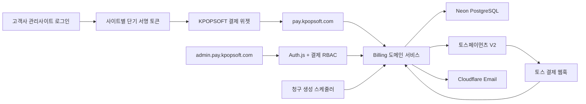

# KPOPSOFT 통합 결제·계약 관리 시스템 설계안

- 작성일: 2026-07-15
- 대상 저장소: `kpopsoft-collab/KPOPSOFT_01`
- 대상 브랜치: `codex/kpopsoft-maxonomy-concept-wind`
- 관련 Linear: [KPO-91](https://linear.app/kpopsoft/issue/KPO-91/kpopsoft-통합-결제계약-관리-시스템-billing-hub)
- 상태: 사용자 승인 완료, 구현 계획 작성 완료

## 1. 목표

KPOPSOFT가 제작·납품한 고객사 홈페이지의 유지관리비, 제작비, 추가 개발비, 교육비를 한 곳에서 계약·청구하고 결제받는 **KPOPSOFT Billing Hub**를 구축한다.

각 고객사 사이트에 PG 연동과 청구 데이터를 중복 구현하지 않는다. 로그인된 고객사 관리사이트에는 KPOPSOFT가 배포하는 공통 결제 위젯만 설치하고, 금액·결제일·납부상태·실제 결제는 중앙 시스템이 결정한다.

첫 운영 버전은 무통장입금과 토스페이먼츠 단건결제를 지원한다. 계약 주기에 따른 청구서 초안은 자동 생성하지만 카드 빌링키를 이용한 자동결제는 지원하지 않는다.

## 2. 확정된 의사결정

- 결제 주체는 KPOPSOFT 단일 사업자이자 단일 토스페이먼츠 가맹점이다.
- 기존 KPOPSOFT Next.js 앱과 Vercel 프로젝트를 확장한다.
- 기존 Neon PostgreSQL, Drizzle ORM, Auth.js, 감사 로그, Cloudflare 이메일 구조를 재사용한다.
- 신규 Supabase 프로젝트나 별도 결제 DB를 도입하지 않는다.
- 고객사 관리사이트에는 로그인 기능이 있으며, 로그인 사용자에게만 위젯 토큰을 발급한다.
- 위젯은 다음 결제일, 결제금액, 납부상태, 결제 버튼을 표시한다.
- 월·연 청구서는 계약 주기에 따라 초안으로 자동 생성한다.
- 관리자가 금액과 기간을 승인해야 고객에게 노출하고 알림을 보낸다.
- 결제수단은 KPOPSOFT 고정계좌 무통장입금, 신용·체크카드, 계약된 주요 간편결제다.
- 토스페이먼츠 결제위젯 V2의 결제창형 연동을 사용한다.
- 토스 단건결제의 전액·부분 취소를 지원한다.
- 세금계산서 발행·연동은 이번 범위에 포함하지 않는다.
- 카드 자동결제, 빌링키, 분할정산, 지급대행은 포함하지 않는다.
- 연체를 이유로 고객사 홈페이지를 자동 중지하지 않는다.

## 3. 범위 분해

전체 시스템은 서로 독립적으로 검증할 수 있는 네 개의 하위 프로젝트로 나눈다.

1. **계약·청구 기반**: 고객사, 사이트, 상품, 계약, 청구서 자동 생성과 승인
2. **결제 처리**: 무통장입금 확인, 토스 단건결제, 취소·환불, 웹훅 정합성
3. **고객사 위젯**: 사이트별 서명 토큰, 결제 요약, 중앙 결제페이지 핸드오프
4. **운영·보안**: 관리자 역할, 감사 로그, 알림, 모니터링, 배포 게이트

각 하위 프로젝트는 별도 구현 계획과 검증 게이트를 가진다. 계약·청구 기반이 먼저 완료되어야 결제 처리와 고객사 위젯이 실제 데이터를 사용할 수 있다.

## 4. 현재 저장소 기준선

현재 저장소는 Next.js 16.2.10 App Router와 React 19.2.4를 사용한다.

- DB: `src/lib/db/schema.ts`, `src/lib/db/index.ts`
- 관리자 인증: `src/auth.ts`, `src/auth.config.ts`
- 관리자 사용자·감사 로그: `src/lib/admin/admin-users.ts`
- 관리자 UI: `src/app/admin/(shell)`
- 이메일: `src/lib/integrations/cloudflare-email.ts`
- 파일 저장: `src/lib/media/blob.ts`
- 외부 API 패턴: `src/app/api/admin/uploads/route.ts`

현재 `admin_users`는 활성 여부만 가지며 결제 승인·환불 권한 구분은 없다. `audit_logs`는 이미 존재하므로 새 감사 시스템을 만들지 않고 결제 행위 유형과 메타데이터 정책을 확장한다.

Next.js 16의 `proxy.ts`는 호스트·경로 분기와 낙관적 세션 확인에만 사용한다. 결제 데이터 접근과 관리자 쓰기 작업의 최종 인가는 Route Handler, Server Action, 도메인 서비스에서 다시 수행한다.

## 5. 전체 아키텍처

### 호스트 역할

- `www.kpopsoft.com`: 기존 공개 홈페이지
- `pay.kpopsoft.com`: 고객 청구서, 결제수단 선택, 결제 결과
- `admin.pay.kpopsoft.com`: 고객사, 계약, 청구서, 입금, 결제, 취소·환불 관리

세 호스트는 같은 Vercel 프로젝트에서 동작한다. 요청 호스트를 내부 라우트로 매핑하되 서비스와 저장소 계층은 `billing` 경계 안에 둔다.

관리자 세션 쿠키는 `admin.pay.kpopsoft.com`의 host-only 쿠키로 유지한다. 고객 결제 세션은 별도 이름과 별도 수명으로 `pay.kpopsoft.com`에만 발급하여 관리자 세션이 고객 결제 호스트로 전달되지 않게 한다.

## 6. 모듈 경계

### 계약·청구 도메인

- 고객사·사이트·상품·계약 규칙
- 다음 청구일 계산
- 청구서 초안 생성과 승인
- 금액 스냅샷과 상태 전이

### 결제 도메인

- 결제 가능 여부와 미결제 금액 검증
- 토스 결제 시도·승인·조회·취소
- 무통장입금 확인
- 결제 및 환불 상태 전이

### 위젯·핸드오프 도메인

- 사이트별 자격증명과 허용 도메인
- 단기 서명 토큰 검증
- 위젯 요약 응답
- 일회성 중앙 결제페이지 핸드오프

### 운영 도메인

- 관리자 역할과 재인증
- 이메일 알림
- 감사 로그와 정합성 점검
- 장애·재시도·외부 의존성 상태

각 모듈은 UI에서 직접 DB를 조작하지 않는다. 페이지, Server Action, Route Handler는 도메인 서비스의 공개 인터페이스만 호출한다.

## 7. 데이터 모델

모든 금액은 부동소수점이 아닌 KRW 정수로 저장한다. 각 테이블은 별도 언급이 없어도 UUID 기본키, `created_at`, `updated_at`을 가진다.

### 고객사·계약

- `billing_customers`
  - 고객사 코드, 상호, 사업자번호, 대표자, 상태
  - 기본 세금계산서 이메일은 저장할 수 있지만 발행 기능에는 사용하지 않는다.
- `billing_customer_contacts`
  - 고객사 담당자 이름, 이메일, 전화번호, 알림 수신 여부
- `billing_sites`
  - 고객사 ID, 사이트 코드, 사이트명, 기본 도메인, 상태
- `billing_products`
  - 유지관리, 제작비, 추가 개발, 교육비 등 상품 코드와 표시명
- `billing_contracts`
  - 고객사·사이트, 계약 상태, 시작일·종료일
  - 청구 방식: `MONTHLY | ANNUAL | ONE_TIME | MANUAL`
  - 다음 청구서 생성일, 납부기한 계산 기준, 자동연장 여부
- `billing_contract_items`
  - 상품, 설명, 수량, 공급가액, 부가세, 총액
  - 청구서 생성 시점에 복제할 계약 가격 스냅샷 원본

한 자동 생성 청구서는 하나의 계약에만 연결한다. 여러 사이트나 계약의 금액을 한 청구서로 합치는 기능은 첫 버전에서 지원하지 않는다.

### 청구

- `billing_runs`
  - 실행일, 시작·종료 시각, 대상 수, 생성 수, 실패 수, 오류 요약
- `billing_invoices`
  - 외부 노출용 난수 청구번호, 고객사·사이트·계약 ID
  - 청구기간, 발행일, 납부기한, 통화
  - 공급가액, 부가세, 총액
  - 상태, 승인자, 승인 시각, 무효 처리자·사유
  - 동일 계약·청구기간 중복을 막는 `generation_key` unique
- `billing_invoice_items`
  - 청구 시점의 상품명, 설명, 수량, 단가, 공급가액, 부가세, 총액
  - 계약 또는 상품이 바뀌어도 과거 청구서 내용은 유지한다.
- `billing_invoice_deliveries`
  - 수신자, 채널, 시도 횟수, 성공·실패 상태, 정제된 오류

### 결제·환불

- `billing_payment_attempts`
  - 청구서, 토스 `orderId`, 요청 금액, 시도 상태, 만료 시각
  - 결제 요청 전에 생성하며 `orderId`는 unique다.
- `billing_payments`
  - 청구서, 결제수단, 승인 금액, 승인 시각
  - 토스 `paymentKey`, 승인번호, 마스킹된 결제수단 정보
  - 무통장입금은 PG 식별자를 저장하지 않는다.
- `billing_bank_receipts`
  - 입금자명, 입금액, 입금일, 확인 관리자, 확인 근거 메모
- `billing_refunds`
  - 결제, 환불금액, 사유, 요청자, 처리자, 토스 거래키, 상태
- `billing_payment_events`
  - 결제·취소·환불 상태 변화의 append-only 정규화 이벤트
- `billing_webhook_receipts`
  - 토스 전송 ID, 이벤트 유형, 수신 시각, 처리 상태, 재시도 횟수
  - 원문 전체 대신 검증과 장애 분석에 필요한 제한된 필드와 payload hash를 저장한다.

### 위젯·보안

- `billing_widget_integrations`
  - 사이트 ID, 공개 식별자, 암호화된 사이트별 HMAC 비밀값
  - 허용 origin, 키 버전, 활성 상태, 마지막 사용 시각
- `billing_handoffs`
  - 일회성 난수 토큰 hash, 사이트·고객사, 만료 시각, 사용 시각
- `billing_admin_roles`
  - 관리자 ID와 결제 역할의 다대다 매핑

사이트별 HMAC 비밀값은 서버 환경변수의 마스터 키로 AES-256-GCM 암호화한다. 평문 비밀값은 생성 직후 한 번만 표시하고 DB·로그·Linear에 기록하지 않는다.

## 8. 상태 모델

### 계약 상태

- `DRAFT`: 아직 청구 대상이 아님
- `ACTIVE`: 자동 청구 대상
- `SUSPENDED`: 보존하지만 신규 청구서 생성 중단
- `ENDED`: 정상 종료
- `CANCELED`: 취소 종료

### 청구서 상태

- `DRAFT`: 자동 또는 수동 생성, 고객에게 비공개
- `OPEN`: 관리자 승인 완료, 결제 가능
- `PAID`: 전액 납부 완료
- `OVERDUE`: 납부기한 경과, 결제 가능
- `PARTIALLY_REFUNDED`: 일부 환불 완료, 재청구하지 않음
- `REFUNDED`: 전액 환불 완료, 재청구하지 않음
- `VOID`: 결제 전 무효 처리

부분 납부는 지원하지 않는다. 계약금·중도금·잔금은 각각 별도 청구서로 발행한다. 환불 후 다시 받아야 하는 금액은 기존 청구서를 되살리지 않고 새 청구서를 발행한다.

### 토스 결제 시도 상태

- `CREATED`: 서버에 주문번호와 금액 스냅샷 저장
- `AUTHENTICATED`: 구매자 결제수단 인증 완료
- `CONFIRMING`: 승인 API 처리 중
- `DONE`: 승인 완료
- `FAILED`: 실패가 확정됨
- `EXPIRED`: 인증 또는 승인 유효시간 만료
- `CANCELED`: 사용자가 결제창을 취소함

모든 상태 전이는 도메인 서비스가 허용 목록으로 검사한다. UI에서 상태 문자열을 직접 저장하지 않는다.

## 9. 청구서 자동 생성

1. 스케줄러는 Asia/Seoul 기준 하루에 한 번 실행한다.
2. `ACTIVE` 계약 중 `next_invoice_date <= 오늘`인 계약을 잠근다.
3. 계약 ID와 청구기간으로 결정적인 `generation_key`를 만든다.
4. 계약 항목을 청구 항목으로 복제하고 금액 합계를 서버에서 다시 계산한다.
5. 청구서 `DRAFT` 생성과 다음 청구일 이동을 하나의 DB 트랜잭션으로 처리한다.
6. unique 제약으로 같은 계약·기간의 중복 생성을 차단한다.
7. 일부 계약이 실패해도 다른 계약 처리는 계속하고 `billing_runs`에 실패를 남긴다.
8. 관리자는 실패 계약만 다시 실행할 수 있다.

월간 계약의 다음 날짜가 해당 월에 없으면 그 달의 마지막 날로 보정한다. 종료일을 넘는 다음 청구서는 생성하지 않는다. 시간대 계산은 서버·DB의 기본 시간대와 무관하게 Asia/Seoul로 고정한다.

관리자 승인 전에는 위젯에 `청구 준비중`과 다음 예정일만 표시하고 금액·결제 버튼은 노출하지 않는다. 승인 시 청구서 금액과 항목을 고정하고 고객 담당자에게 알림을 보낸다.

## 10. 고객사 위젯과 결제페이지 핸드오프

공통 위젯은 버전이 고정된 Web Component 스크립트로 제공한다. iframe의 서드파티 쿠키에 의존하지 않는다.

1. 고객사 관리사이트 백엔드가 로그인 세션을 검증한다.
2. 백엔드는 사이트별 비밀값으로 최대 120초 유효한 HMAC 토큰을 발급한다.
3. 토큰은 `iss`, `aud`, `siteId`, 난수 사용자 참조, `iat`, `exp`, `jti`, 키 버전을 가진다.
4. 토큰에는 고객명, 이메일, 청구번호, 금액, 결제상태를 넣지 않는다.
5. 위젯은 토큰을 Bearer 헤더로 중앙 요약 API에 전달한다.
6. 중앙 API는 서명, 만료, 키 버전, 허용 origin, 사이트 상태를 검사한다.
7. 결제 버튼을 누르면 중앙 서버가 5분 유효한 일회성 `billing_handoff`를 생성한다.
8. 브라우저는 난수 핸드오프 URL로 `pay.kpopsoft.com`에 최상위 이동한다.
9. 중앙 결제페이지는 토큰을 한 번만 소비하고 고객사·사이트 범위의 결제 세션을 발급한다.

위젯은 가장 먼저 납부해야 하는 `OPEN` 또는 `OVERDUE` 청구서 한 건을 기본 표시한다. 같은 사이트에 여러 미납 청구서가 있으면 건수를 함께 표시하고 중앙 결제페이지에서 목록을 보여준다. 결제는 청구서별로 한 건씩 진행한다.

허용 origin은 정확한 scheme과 host로 등록하며 wildcard를 허용하지 않는다. 위젯 API는 CORS allowlist, 속도 제한, 토큰 재사용 감지, 응답 `Cache-Control: no-store`를 적용한다.

## 11. 무통장입금

- 첫 버전은 KPOPSOFT 고정계좌 한 개를 사용한다.
- 계좌정보는 운영 설정에 저장하고 저장소·클라이언트 번들·로그에 남기지 않는다.
- 승인된 청구서에만 계좌정보와 권장 입금자명·청구번호를 표시한다.
- 고객이 무통장입금을 선택해도 청구서 상태는 `OPEN` 또는 `OVERDUE`로 유지한다.
- 관리자는 실제 입금내역에서 입금자명, 입금액, 입금일을 확인한 후에만 `PAID`로 전환한다.
- 입금액은 청구서 총액과 정확히 일치해야 한다.
- 부족·초과 입금은 납부완료 처리하지 않고 운영 예외로 남긴다.
- 동일 청구서에 완료된 결제가 있으면 두 번째 입금확인을 차단한다.
- 확인 관리자, 시각, 근거 메모를 감사 로그와 `billing_bank_receipts`에 보존한다.

운영 계좌가 설정되지 않으면 무통장입금 선택지를 fail-closed로 숨긴다.

## 12. 토스페이먼츠 단건결제

토스페이먼츠 결제위젯 V2 결제창형을 사용한다. 계약된 신용·체크카드와 주요 간편결제를 위젯 관리자에서 노출한다.

1. 서버는 청구서가 `OPEN | OVERDUE`이고 기존 완료 결제가 없는지 확인한다.
2. 서버는 난수 `orderId`와 청구서 미결제 금액을 `billing_payment_attempts`에 먼저 저장한다.
3. 브라우저는 공개 클라이언트 키와 서버가 반환한 주문번호·금액으로 결제창을 연다.
4. 성공 리다이렉트의 `paymentKey`, `orderId`, `amount`를 신뢰하지 않고 DB 스냅샷과 비교한다.
5. 금액·주문번호·청구상태가 모두 일치할 때만 서버 시크릿 키로 승인 API를 호출한다.
6. POST 요청에는 UUID v4 `Idempotency-Key`를 사용하고 첫 요청 결과를 보존한다.
7. 승인 응답의 결제 키, 승인번호, 결제수단, 승인금액, 승인시각을 저장한다.
8. 승인과 청구서 `PAID` 전환을 하나의 애플리케이션 트랜잭션 경계에서 처리한다.
9. 승인 결과가 불명확한 타임아웃에서는 새 주문을 만들기 전에 결제 조회 API로 상태를 확인한다.

토스 시크릿 키는 서버 전용 환경변수에만 저장한다. 테스트 키와 운영 키는 다른 Vercel 환경에 두며 한 환경변수에서 혼용하지 않는다.

## 13. 웹훅과 정합성 보정

일반 결제의 `PAYMENT_STATUS_CHANGED`와 `CANCEL_STATUS_CHANGED` 웹훅에는 서명 헤더가 없다. 웹훅 payload만으로 결제 상태를 확정하지 않는다.

1. HTTPS POST와 허용된 JSON 크기·스키마를 검사한다.
2. `tosspayments-webhook-transmission-id`를 unique로 저장해 재전송을 멱등 처리한다.
3. payload의 `paymentKey`로 토스 결제 조회 API를 다시 호출한다.
4. 조회 결과의 MID, `paymentKey`, `orderId`, 금액, 상태를 내부 결제 시도와 대조한다.
5. 일치한 조회 결과만 상태 전이에 사용한다.
6. 동일 상태 이벤트는 무시하고 새로운 전이만 append-only 이벤트로 기록한다.
7. 처리가 완료되면 토스 정책에 맞춰 10초 이내 `200`을 반환한다.
8. 일시적 조회 실패는 non-2xx로 재전송을 유도하고 내부 정합성 복구 작업에도 남긴다.

토스는 실패한 웹훅을 최대 7회 재전송하므로 중복 수신은 정상 상황으로 취급한다. 스케줄러는 처리 미완료 웹훅과 `CONFIRMING` 상태가 오래 지속된 결제를 주기적으로 조회하여 정합성을 복구한다.

## 14. 취소·부분환불

- 취소 요청자는 `BILLING_REFUND` 권한과 최근 재인증을 가져야 한다.
- 환불금액은 1원 이상이며 토스 조회 결과의 환불 가능 잔액 이하여야 한다.
- 요청 사유는 필수이며 감사 로그에 저장한다.
- 토스 취소 POST에도 고유 `Idempotency-Key`를 사용한다.
- provider가 부분취소 불가로 반환하면 전액취소만 허용하고 관리자에게 이유를 표시한다.
- 성공 응답의 `transactionKey`, 취소금액, 취소시각을 저장한다.
- 웹훅 또는 재조회 결과와 일치할 때 `PARTIALLY_REFUNDED | REFUNDED`를 확정한다.
- 환불 실패나 타임아웃은 성공으로 표시하지 않고 `PROCESSING | FAILED`로 보존한다.

환불 완료 후 다시 받아야 하는 금액은 새 청구서로 처리한다. 환불된 기존 청구서의 금액·결제 이력은 수정하거나 삭제하지 않는다.

## 15. 관리자 권한과 감사

결제 권한은 기존 관리자 활성 여부와 별도로 관리한다.

- `BILLING_VIEW`: 고객사·계약·청구·결제 조회
- `BILLING_EDIT`: 고객사·계약·청구서 초안 편집
- `BILLING_APPROVE`: 청구 승인·무효화, 무통장입금 확인
- `BILLING_REFUND`: 토스 전액·부분 취소
- `BILLING_ADMIN`: 결제 권한, 위젯 키, 운영 설정 관리

최초 도입 시 기존 활성 관리자에게 `BILLING_ADMIN`을 자동 부여하지 않는다. 배포 시 명시한 최소 인원만 시드한다.

청구 승인, 무통장입금 확인, 무효화, 환불, 역할 변경, 위젯 키 발급·회전은 모두 감사 로그에 남긴다. 로그에는 카드정보, 토스 시크릿, 위젯 비밀값, 전체 웹훅 payload를 저장하지 않는다.

고위험 작업은 15분 이내의 최근 로그인 또는 Google 재인증을 요구하고 대상·금액·사유를 최종 확인 화면에 다시 표시한다. 앱 자체 두 번째 인증수단 도입은 첫 버전 범위에서 제외하며 운영 관리자 Google 계정에는 2단계 인증을 필수 정책으로 적용한다.

## 16. 알림

- 청구 승인: 고객 담당자에게 청구기간, 금액, 납부기한과 관리사이트 로그인 안내
- 결제 완료: 카드·간편결제 또는 무통장입금 확인 결과
- 결제 실패: 고객에게 안전한 재시도 안내, 관리자에게 오류 범주 알림
- 납부기한 임박·연체: 계약별 알림 정책에 따라 관리자 검토 후 발송
- 환불 완료: 환불금액과 처리일 안내

고객 이메일에는 직접 결제 가능한 영구 URL을 넣지 않는다. 고객사 관리사이트에 로그인해 위젯을 이용하도록 안내한다. Cloudflare 이메일 실패는 청구·결제 상태를 되돌리지 않고 `billing_invoice_deliveries`에 재시도 대상으로 남긴다.

문자·알림톡은 이번 범위에서 제외한다.

## 17. 오류 처리

- DB 연결 또는 필수 결제 설정이 없으면 mock 결제로 대체하지 않는다.
- 금액·상태·권한 검증에 실패하면 외부 결제 API를 호출하지 않는다.
- 공급자 원문 오류, 키, 내부 ID, stack trace를 고객에게 노출하지 않는다.
- 고객에게는 재시도 가능 여부와 안전한 다음 행동만 표시한다.
- 알 수 없는 승인 결과는 실패로 단정하지 않고 조회·정합성 복구 대상으로 둔다.
- 중복 클릭과 네트워크 재시도는 unique 제약과 멱등키로 흡수한다.
- 청구 생성, 승인, 입금확인, 결제확정은 DB 트랜잭션과 행 잠금으로 경쟁 상태를 막는다.
- 삭제 대신 비활성·무효·취소 상태를 사용하여 거래 이력을 보존한다.

## 18. 개인정보와 보존

- 카드번호, 유효기간, CVC, 계좌 비밀번호, 인증 비밀번호를 저장하지 않는다.
- 토스에서 받은 카드번호는 마스킹된 값만 저장한다.
- 고객 담당자 개인정보는 청구 알림과 계약 운영에 필요한 범위로 제한한다.
- 서버 로그에는 고객 이메일·전화번호·청구서 전체 내용·결제 키를 그대로 남기지 않는다.
- 관리자 목록과 감사 로그에는 최소 식별자와 행위 요약만 남긴다.
- 개인정보 삭제 요청이 있어도 법적·정산상 보존이 필요한 거래 기록은 익명화 또는 접근 제한으로 처리하고 임의 삭제하지 않는다.

PG 신청용 사업자 정보는 Linear RUS-5와 원본 사업자등록증에서 관리한다. 대표자 생년월일과 등록증 검증 코드는 영구 Git 기록에 복제하지 않는다.

## 19. 고객·관리자 화면

### 고객사 위젯

- 다음 결제일
- 결제금액
- 상태: 결제 예정, 결제 가능, 연체, 결제 완료, 청구 준비중
- 결제 또는 상세 보기 버튼
- 데이터 조회 실패 시 금액을 추정하지 않고 `결제 정보를 불러오지 못했습니다` 표시

### 중앙 결제페이지

- 고객사·사이트·청구기간·청구항목·공급가액·부가세·총액
- 납부기한과 현재 상태
- 무통장입금 또는 토스 결제 선택
- 결제 진행·성공·실패·확인중 상태
- 모바일 결제 앱 이동과 복귀 지원

### 관리자

- 고객사·사이트·계약 검색과 상태 필터
- 청구서 초안 검토·승인·무효
- 입금확인과 근거 기록
- 카드·간편결제 상태와 공급자 조회
- 취소·부분환불
- 실패 웹훅·결제 정합성 점검
- 감사 로그

## 20. 구축 단계와 게이트

### 단계 0 — 토스 가입·운영 정책

- 토스페이먼츠 전자결제 신청
- 카드와 주요 간편결제 계약
- 사업자정보, 이용약관, 개인정보처리방침, 환불정책, 서비스 설명 정비
- 테스트 키와 운영 키 분리
- 운영 키·MID·웹훅 URL 확보

완료 게이트: 테스트 키 연동은 가능하지만 운영 결제 활성화는 가맹점 심사와 결제수단 계약이 완료되어야 한다.

### 단계 1 — 계약·청구 기반

- 스키마와 마이그레이션
- 고객사·사이트·상품·계약 관리
- 청구서 초안 자동 생성
- 관리자 검토·승인과 이메일
- 감사 로그와 권한

완료 게이트: 동일 계약·기간 중복 청구 방지와 미승인 청구서 비공개가 자동 테스트와 브라우저에서 확인되어야 한다.

### 단계 2 — 무통장입금

- 계좌 설정
- 고객 결제 안내
- 관리자 입금확인
- 중복·부족·초과 입금 방지

완료 게이트: 실제 입금 확인 전에는 어떤 경로에서도 `PAID`가 되지 않아야 한다.

### 단계 3 — 토스 단건결제

- V2 결제창형
- 결제 시도·승인·조회
- 카드·간편결제
- 웹훅과 정합성 복구
- 전액·부분 취소

완료 게이트: 테스트 키로 조작·중복·타임아웃·취소·웹훅 재전송 시나리오를 통과해야 한다.

### 단계 4 — 고객사 위젯

- 버전 고정 Web Component
- 사이트별 키와 origin 정책
- Next.js, PHP, 일반 REST 발급 예제
- 중앙 결제페이지 핸드오프
- 첫 고객사 스테이징 적용

완료 게이트: 고객사 비로그인 상태, 만료 토큰, 재사용 토큰, 잘못된 origin에서는 청구정보가 노출되지 않아야 한다.

### 단계 5 — 운영 전환

- Preview에서 전체 흐름 검증
- 운영 도메인과 인증서
- 운영 키·MID·웹훅 등록
- 소액 실결제·전액취소 리허설
- 운영자 매뉴얼과 장애 대응

완료 게이트: 토스 외부 심사, 운영 비밀값, 실제 결제 리허설이 완료되지 않으면 Production 활성화는 `HOLD`다.

## 21. 테스트 전략

### 단위 테스트

- 월·연 다음 청구일과 월말 보정
- 계약 종료일 이후 생성 차단
- 금액·부가세·합계 정수 계산
- 청구·결제·환불 상태 전이 허용 목록
- 위젯 토큰 서명, 만료, 키 버전, origin 검증
- 관리자 역할별 허용·거부
- 토스 응답과 내부 상태 매핑

### DB·통합 테스트

- `generation_key`와 `orderId` 중복 차단
- 자동 생성과 다음 청구일 갱신의 원자성
- 승인 중 동시 수정 차단
- 카드결제와 무통장입금의 이중 결제 차단
- 승인·웹훅 순서 역전과 중복 재전송
- 환불 가능 금액과 동시 취소 요청
- 이메일 성공·실패가 청구 상태에 미치는 영향
- 감사 로그 누락 방지

### 보안 테스트

- success URL의 금액·주문번호 변조
- 다른 사이트·고객사의 청구번호 접근
- 만료·재사용·다른 audience의 위젯 토큰
- 허용되지 않은 origin과 CORS preflight
- 미로그인·비활성·권한 부족 관리자
- 웹훅 위조 payload가 조회 검증 없이 반영되지 않는지 확인
- 로그·응답·브라우저 번들에서 비밀값 검색

### 브라우저 테스트

- 고객사 위젯의 예정·준비중·결제 가능·연체·완료 상태
- 중앙 결제페이지 모바일·데스크톱
- 토스 결제 성공·사용자 취소·실패·복귀
- 무통장입금 안내와 입금확인 후 위젯 갱신
- 관리자 고객사·계약·청구·입금·환불 흐름
- 390px 모바일에서 가로 넘침과 터치 영역

### 외부 검증

- 토스 테스트 키 카드·간편결제
- 개발자센터 웹훅 재전송
- 운영 소액 실결제와 전액취소
- 실제 고객사 스테이징 사이트의 로그인·토큰·핸드오프

외부 계정·키·실결제가 없는 테스트는 완료로 가장하지 않고 `HOLD`로 보고한다.

## 22. 배포·롤백

- Preview는 별도 Neon 브랜치와 토스 테스트 키만 사용한다.
- Production DB 마이그레이션은 기존 앱과 양방향 호환되는 expand-first 방식으로 적용한다.
- `BILLING_ENABLED`, `BANK_TRANSFER_ENABLED`, `TOSS_PAYMENTS_ENABLED`, `BILLING_WIDGET_ENABLED` 서버 플래그를 둔다.
- 필수 설정이 없으면 해당 기능을 fail-closed로 비활성화한다.
- 고객사 위젯은 사이트별 활성화 플래그로 순차 배포한다.
- 결제 기능 롤백 시 신규 결제 시도만 차단하고 기존 결제·웹훅 조회 엔드포인트는 유지한다.
- DB 행과 결제 이력은 배포 롤백으로 삭제하지 않는다.
- 토스 키 교체는 새 키 등록, 앱 배포, 검증, 이전 키 만료 순서로 수행한다.

## 23. 관측성과 운영

- 청구 생성 수·실패 수
- 승인 대기 청구 수
- 결제 시도·성공·실패율
- `CONFIRMING` 장기 체류 건
- 웹훅 처리 지연·재시도·실패 건
- 미입금·연체 건
- 환불 처리중·실패 건

대시보드가 없어도 관리자 화면에서 운영 큐를 조회할 수 있어야 한다. 로그에는 내부 상관관계 ID를 사용하고 공급자 오류는 코드와 정제된 요약만 남긴다.

## 24. 외부 의존성 및 HOLD

- 토스페이먼츠 가입과 가맹점 심사
- 카드·토스페이·네이버페이·카카오페이 계약 승인
- 테스트·운영 키와 MID
- `pay.kpopsoft.com`, `admin.pay.kpopsoft.com` DNS·인증서
- 운영 무통장입금 계좌정보
- 위젯 사이트별 로그인 구조와 서버 수정 권한
- 운영 관리자 Google 2단계 인증 확인
- 소액 실결제·취소에 대한 사용자 승인

HOLD 항목은 코드에서 우회하거나 가짜 성공으로 대체하지 않는다.

## 25. 범위 밖

- 카드 빌링키와 자동결제
- 고객사별 PG 가맹점 및 분할정산
- 세금계산서 발행 API
- 문자·알림톡
- 강의 일정·정원·수강생·수료증 관리
- 유지보수 작업일지와 고객 확인
- 계약서 전자서명·파일 보관
- 여러 계약을 하나의 청구서로 합치는 기능
- 부분 납부와 선납금 잔액 관리
- 앱 자체 OTP 또는 별도 MFA 공급자

후속 기능은 계약·청구·결제 기반의 실제 운영 결과를 확인한 뒤 별도 설계와 구현 계획으로 진행한다.

## 26. 완료 기준

- 승인되지 않은 청구서는 고객에게 노출되거나 결제될 수 없다.
- 동일 계약·기간의 청구서가 두 번 생성되지 않는다.
- 위젯과 토스 승인 금액은 서버 청구서 금액과 항상 일치한다.
- 고객사 사이트에 PG 시크릿, 청구 금액 원본, 카드정보가 저장되지 않는다.
- 토스 success URL과 일반 결제 웹훅 payload만으로 결제완료 처리하지 않는다.
- 웹훅 재전송과 승인 타임아웃 후에도 최종 상태를 결제 조회로 복구한다.
- 이미 납부된 청구서의 이중 결제를 막는다.
- 무통장입금은 관리자 확인 전 `PAID`가 되지 않는다.
- 청구 승인, 입금확인, 취소·환불, 권한 변경 이력이 남는다.
- 테스트 키와 운영 키가 분리되고 비밀값이 코드·로그·Linear에 노출되지 않는다.
- 테스트, 빌드, Preview 브라우저 검증 결과가 문서화된다.
- 외부 심사·운영 키·실결제가 없으면 Production 결제 활성화 상태를 `HOLD`로 보고한다.

## 27. 공식 기술 기준

- [토스페이먼츠 결제 흐름](https://docs.tosspayments.com/guides/v2/get-started/payment-flow)
- [토스페이먼츠 결제위젯 V2](https://docs.tosspayments.com/guides/v2/payment-widget)
- [토스페이먼츠 결제창형 연동](https://docs.tosspayments.com/guides/v2/payment-widget/integration-window)
- [토스페이먼츠 웹훅](https://docs.tosspayments.com/guides/v2/webhook)
- [토스페이먼츠 LLM Quick Reference](https://docs.tosspayments.com/guides/v2/get-started/llms-quick-reference)
- 저장소의 `node_modules/next/dist/docs/01-app/` 아래 Next.js 16.2.10 문서

구현 시작 전 설치된 패키지 버전의 Next.js 문서와 토스 V2 공식 문서를 다시 확인한다. 토스 일반 결제 웹훅에는 서명 헤더가 없으므로 결제 조회 API 재검증을 필수로 유지한다.
