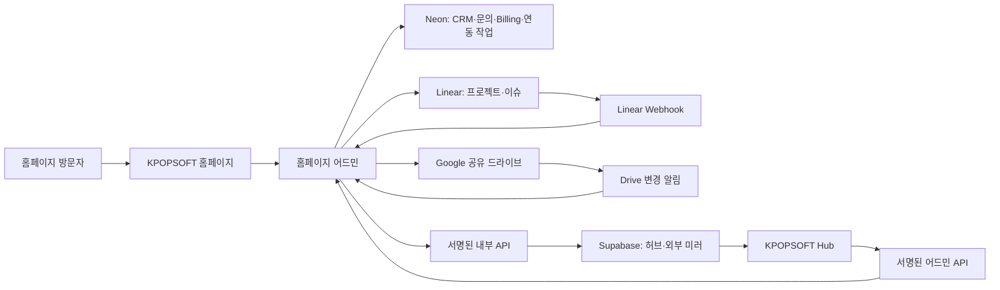
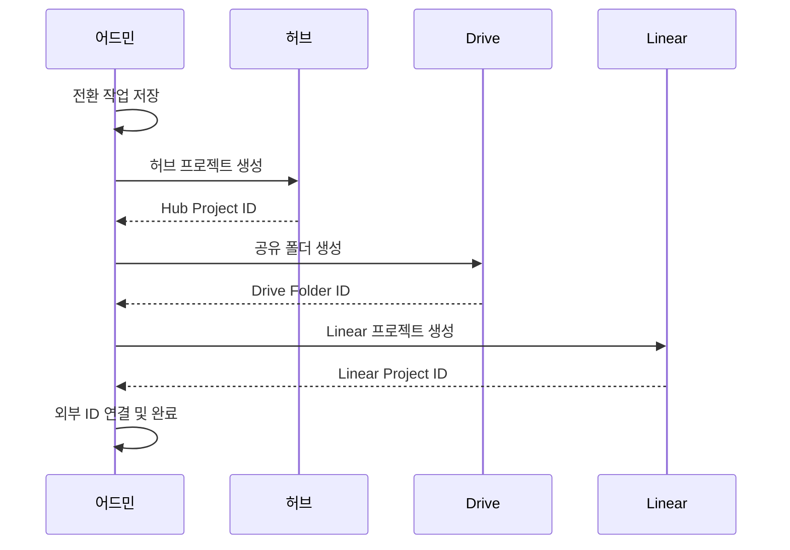

# KPOPSOFT 통합 운영 연동 설계

- 작성일: 2026-07-19
- 상태: 사용자 설계 승인 완료
- 홈페이지·어드민 저장소: `kpopsoft-collab/KPOPSOFT_01`
- 허브 저장소: `h19h29-design/kpopsoft-hub`
- Linear 팀: `Kpopsoft` (`KPO`)
- 관련 Linear 프로젝트: `협업툴 개발`

## 1. 목표

기존 KPOPSOFT 홈페이지 어드민, 내부 협업 허브, Linear, Google 공유
드라이브를 하나의 운영 흐름으로 연결한다.

사용자는 같은 프로젝트를 어드민, 허브, Linear에서 확인할 수 있어야 한다.
각 시스템이 잘하는 영역은 유지하고, 모든 필드를 무리하게 양방향
동기화하지 않는다. 데이터별 원본 시스템을 명시하고 다른 시스템은 링크,
미러, 읽기 전용 요약을 제공한다.

핵심 결과는 다음과 같다.

- 홈페이지 문의를 어드민에서 상담하고 허브 프로젝트로 전환한다.
- 전환 시 허브 프로젝트, Drive 폴더, Linear 프로젝트를 멱등 생성한다.
- Linear에서 직접 만든 프로젝트와 이슈도 허브에 자동으로 가져온다.
- 허브에서 Linear 업무를 조회하고 제한된 생성·수정·이동을 수행한다.
- Google 공유 드라이브의 폴더와 파일 메타데이터를 허브에서 확인한다.
- 계약·청구·결제는 어드민에서만 변경하고 허브에는 읽기 전용 요약만
  표시한다.
- 기획 단계 변경, 다른 프로젝트로 업무 이동, 새 프로젝트 분리를
  지원한다.
- 교육 신청 구조는 향후 변경할 수 있도록 공통 문의와 버전이 있는 원본
  제출 데이터를 분리한다.

## 2. 현재 기준선

### 2.1 홈페이지·어드민

`kpopsoft-homepage`는 다음 기능을 이미 갖는다.

- Next.js 16 App Router, React 19, TypeScript
- Auth.js Google OAuth와 Neon `admin_users` 허용 목록
- Neon Postgres와 Drizzle ORM
- 문의 접수, 문의 옵션, 상태·메모·검색
- Cloudflare 이메일 알림
- 문의별 Linear 이슈 생성과 재시도
- Vercel Blob 콘텐츠 미디어
- 고객사, 계약, 청구서, 무통장 입금, Toss 결제, 환불
- 결제 관리자 역할과 고위험 작업 재인증
- 감사 로그와 Vercel Cron

현재 Linear 연동은 문의 한 건을 Linear 이슈 한 건으로 만드는 단방향
연동이다. 프로젝트·이슈 전체 미러, Webhook 수신, Drive API, 허브 전환은
아직 없다.

현재 Linear 이슈 본문에는 문의 연락처와 본문 전체가 포함된다. 새 설계에서는
개인정보 최소화를 위해 유형, 짧은 요약, 어드민 상세 링크만 전달한다.

### 2.2 내부 협업 허브

`kpopsoft-hub`는 다음 기능을 Supabase에서 운영한다.

- 등록된 팀원만 사용하는 Google 로그인
- 프로젝트, 참여자, 일정, 회의, 교육, 자료, 정산, 툴 링크
- 월간 일정과 프로젝트 기간 자동 표시
- 팀원별 프로젝트·일정 요약
- 프로젝트 상태 변경, 보관, 이동 기반 UI
- Google Drive 링크의 수동 등록

현재 Drive 파일 목록 동기화와 Linear API 연동은 없다.

### 2.3 외부 서비스

- Linear은 현재 `Kpopsoft` 단일 팀으로 운영한다.
- 업무 구분은 당분간 팀 분리 대신 프로젝트 라벨, 이슈 라벨, 사용자 정의
  화면으로 처리한다.
- Google Drive는 공유 드라이브다.
- Vercel은 홈페이지·어드민과 허브 실행 환경이다.
- Cloudflare는 DNS, 도메인 메일, 공개 폼 보호를 담당한다.
- Render는 초기 필수 구성에 넣지 않는다. Vercel 실행시간이나 처리량을
  넘는 동기화 작업이 확인된 뒤 작업 전용 서버로 도입한다.

## 3. 확정된 의사결정

### 3.1 기존 두 데이터베이스 유지

홈페이지 어드민의 Neon과 허브의 Supabase를 유지한다.

- Neon 원본: 고객, 문의, 상담, 홈페이지 콘텐츠, 계약, 청구, 결제, 환불,
  외부 연동 작업
- Supabase 원본: 허브 프로젝트, 일정, 참여자, 회의, 교육, 자료, 내부 정산

기존 Billing 구현을 Supabase로 옮기거나 허브 데이터를 Neon으로 옮기지
않는다. 두 앱은 서명된 서버 간 API와 멱등 이벤트로 연결한다.

### 3.2 외부 연동 관문

홈페이지 어드민을 Linear와 Drive 연동의 관문으로 사용한다.

- Linear API 키와 Drive OAuth 갱신 토큰은 홈페이지 Vercel 서버에만 둔다.
- 허브에는 외부 공급자 비밀값을 저장하지 않는다.
- 어드민은 외부 Webhook을 검증하고 수신 기록을 Neon에 먼저 저장한다.
- 실제 처리는 재시도 가능한 작업으로 실행한다.
- 허브는 서명된 내부 이벤트만 받아 Supabase 미러를 갱신한다.

### 3.3 Linear 단일 팀 유지

현재 9명 규모와 초기 사용 단계를 고려해 Linear 팀은 하나로 유지한다.

프로젝트는 다음 분류를 사용한다.

- 고객 프로젝트
- 교육
- 내부 운영

이슈는 다음 업무 유형을 사용한다.

- 기획
- 개발
- 디자인
- 교육 운영
- 고객 응대

향후 여러 팀으로 분리할 수 있도록 모든 Linear 미러 테이블과 연동 설정은
`linear_team_id`를 가진다.

### 3.4 결제 변경은 어드민에서만 수행

계약, 청구, 입금 확인, 결제, 환불은 홈페이지 어드민이 유일한 원본이다.

허브는 프로젝트별 다음 항목만 읽기 전용으로 표시한다.

- 계약 상태
- 총 청구금액
- 결제 완료금액
- 미수금
- 최근 청구일
- 다음 납부기한
- 마지막 동기화 시각
- 어드민 상세 링크

허브에는 고객 연락처, 계좌정보, Toss 결제키, 공급자 원문, 환불 상세,
관리자 권한을 전달하지 않는다.

## 4. 전체 아키텍처



### 4.1 시스템별 데이터 소유권

| 데이터 | 원본 | 다른 시스템의 역할 |
|---|---|---|
| 고객·문의·상담 | 어드민/Neon | 허브에서 프로젝트 연결 확인 |
| 계약·청구·결제·환불 | 어드민/Neon | 허브에서 읽기 전용 요약 |
| 프로젝트·일정·참여자·정산 | 허브/Supabase | 어드민에서 연결 상태 확인 |
| 세부 업무·담당자·우선순위·진행률 | Linear | 허브에서 미러 및 제한된 명령 |
| 폴더·파일·문서 | Google Drive | 허브에서 메타데이터·링크 표시 |
| 홈페이지 콘텐츠 | 어드민/Neon | 허브와 동기화하지 않음 |

## 5. 문의와 고객 운영

### 5.1 문의 유형

모든 공개 접수는 공통 문의로 저장한다.

- 교육 신청
- 프로젝트 제작 문의
- 협업·제휴 문의
- 일반 문의

교육 신청도 고객 문의의 한 종류로 취급한다. 교육 운영 구조가 변경돼도
공통 문의 파이프라인은 유지한다.

### 5.2 문의 파이프라인

기존 `new | in_progress | done` 상태는 다음 운영 단계로 확장한다.

1. 신규
2. 담당자 배정
3. 연락 중
4. 요구사항 확인
5. 견적·제안
6. 수주
7. 프로젝트 또는 교육 전환
8. 완료
9. 보류·실패

화면 라벨은 한국어를 사용하고 DB 값은 안정적인 영문 enum을 사용한다.

### 5.3 원본 제출 보존

공통 검색과 운영에 필요한 값은 정규화된 열로 저장한다.

- 문의 유형과 세부 유형
- 신청자 또는 회사명
- 담당 연락처
- 담당 관리자
- 파이프라인 단계
- 다음 연락일
- 접수 경로
- 전환 상태

폼별 원본 제출은 `form_version`과 검증된 `raw_payload` JSON으로 함께
보존한다. 교육 전용 입력 구조가 바뀌어도 과거 신청 내용을 잃지 않는다.
비밀번호, 결제수단 비밀값, 인증 토큰은 원본 제출에 저장하지 않는다.

## 6. 문의에서 프로젝트로 전환

### 6.1 전환 시작

관리자가 문의 상세에서 `프로젝트로 전환`을 실행한다.

필수 입력은 다음과 같다.

- 프로젝트명
- 프로젝트 유형
- 담당자
- 참여 후보
- 시작일과 목표일
- Linear 프로젝트 생성 여부
- Drive 폴더 생성 여부
- 기존 고객·계약 연결 여부

전환 요청은 결정적인 `conversion_key`로 한 번만 생성한다.

### 6.2 전환 단계



1. Neon에 전환 작업과 단계별 상태를 저장한다.
2. 서명된 API로 허브 프로젝트를 생성한다.
3. 공유 드라이브 프로젝트 폴더를 생성한다.
4. 필요하면 Linear 프로젝트를 생성한다.
5. 어드민 ID, Hub ID, Drive ID, Linear ID를 연결한다.
6. 문의를 `전환 완료`로 표시한다.

일부 단계가 실패해도 이미 생성된 원격 데이터를 자동 삭제하지 않는다.
실패한 단계부터 재시도한다.

## 7. Linear와 허브 이중 운영

### 7.1 미러 범위

현재 Linear 팀의 다음 데이터를 허브 Supabase에 가져온다.

- 팀
- 사용자
- 프로젝트
- 이슈
- 프로젝트 상태
- 이슈 상태
- 담당자
- 우선순위
- 시작일·목표일·마감일
- 보관·삭제 여부
- 원본 URL
- 외부 수정 시각

댓글, Linear 문서, Cycle 설정, 첨부 파일 본문은 초기 미러 범위에서
제외한다. 허브에서 `Linear에서 열기`를 제공한다.

### 7.2 Linear에서 생성된 프로젝트

Linear에서 직접 만든 프로젝트는 허브의 `Linear에서 가져옴` 목록에 자동
표시한다.

연결 상태는 다음과 같다.

- `unlinked`: 허브 프로젝트와 연결되지 않음
- `linked`: 기존 허브 프로젝트와 연결됨
- `imported`: Linear 항목을 기반으로 새 허브 프로젝트를 생성함
- `conflict`: ID나 소유권 규칙을 수동 확인해야 함
- `archived`: 외부에서 보관 또는 삭제됨

사용자는 미연결 프로젝트에서 다음 작업을 할 수 있다.

- 기존 허브 프로젝트에 연결
- 새 허브 프로젝트로 가져오기
- 내부 운영 항목으로 분류
- 무시 또는 보관

자동 미러는 Linear 프로젝트를 곧바로 허브의 정산·일정 원본으로 승격하지
않는다. 사용자의 연결 또는 가져오기 작업이 있어야 허브 프로젝트가 된다.

### 7.3 상태와 필드 소유권

허브 프로젝트 상태와 Linear 프로젝트 상태를 강제로 하나로 합치지 않는다.

- 허브 상태: 문의, 검토, 기획, 진행, 완료, 보류, 보관
- Linear 상태: Linear 프로젝트 진행 상태와 이슈 진행률

허브 UI에 두 값을 각각 표시한다. Linear의 세부 이슈 필드는 Linear가
원본이다. 고객, 예산, 참여자, 일정, 정산 필드는 허브가 원본이다.

### 7.4 허브에서 Linear 쓰기

허브는 다음 제한된 명령을 지원한다.

- Linear 이슈 생성
- 제목 변경
- 상태 변경
- 담당자 변경
- 우선순위 변경
- 마감일 변경
- 다른 Linear 프로젝트로 이동
- 보관

허브는 Supabase 미러 행을 직접 확정 값으로 수정하지 않는다. 어드민 연동
API가 Linear를 변경하고, Linear Webhook이 돌아온 뒤 미러를 확정한다.
UI에는 처리 중 상태를 표시한다.

### 7.5 Webhook과 정합성 보정

- Linear Webhook의 원문 본문, 서명, timestamp를 검증한다.
- 공급자 delivery ID를 unique로 저장한다.
- 수신 기록을 저장한 뒤 5초 안에 성공 응답을 반환한다.
- 실제 변환과 허브 전달은 별도 작업으로 처리한다.
- 같은 이벤트 재전송은 성공 처리하되 중복 적용하지 않는다.
- 매일 증분 정합성 점검을 실행한다.
- 어드민에 `지금 동기화`를 제공한다.

## 8. 프로젝트 단계, 이동, 분리

### 8.1 단계 변경

`문의 → 기획 → 진행 → 납품 → 완료`는 같은 허브 프로젝트의 상태를
변경한다. 새 프로젝트를 만들지 않는다.

다음 연결은 그대로 유지한다.

- 참여자
- 일정
- 회의
- Drive 폴더
- Linear 프로젝트
- 계약·청구 요약
- 정산
- 변경 이력

### 8.2 업무 이동

특정 Linear 이슈는 다른 Linear 프로젝트로 이동할 수 있다.

- 단일 이동과 다중 선택 이동을 지원한다.
- 이전 프로젝트, 새 프로젝트, 작업자, 시각, 사유를 기록한다.
- Linear API 성공 후 Webhook으로 허브 미러를 확정한다.
- 같은 Linear 팀 안의 이동을 기본 지원한다.

### 8.3 새 프로젝트로 분리

기획 결과가 별도 사업이나 계약으로 나뉘면 `새 프로젝트로 분리`를
사용한다.

분리 시 선택할 수 있는 항목은 다음과 같다.

- 복사할 참여자
- 이동할 Linear 이슈
- 복사할 일정
- 연결할 기존 Drive 자료
- 새 Drive 폴더 생성
- 새 Linear 프로젝트 생성

원본과 새 프로젝트는 `parent | derived` 관계로 연결한다.

계약·청구·결제 연결은 자동 이동하지 않는다. 어드민에서 확인 후 새
프로젝트에 연결한다. Drive 파일도 기본적으로 물리 이동하지 않고 링크를
유지한다. 사용자가 명시적으로 선택한 경우에만 이동한다.

## 9. Google 공유 드라이브

### 9.1 접근 방식

공유 드라이브에 접근할 전용 연동 계정을 사용한다.

- 최소 권한 OAuth scope를 선택한다.
- 갱신 토큰은 홈페이지 Vercel 서버 비밀값으로 저장한다.
- 팀원 각자의 Google OAuth 세션에 Drive 권한을 추가하지 않는다.
- 공유 드라이브 ID와 프로젝트 루트 폴더 ID를 설정으로 관리한다.

### 9.2 프로젝트 폴더

기본 폴더 구조는 다음과 같다.

```text
프로젝트명
├── 01_문의·계약
├── 02_기획
├── 03_디자인
├── 04_개발
├── 05_회의·피드백
└── 06_납품
```

폴더 이름은 관리자가 변경할 수 있다. 연결은 URL이나 경로가 아니라
Google `fileId`로 유지한다.

### 9.3 허브 미러

허브에는 다음 메타데이터만 저장한다.

- Drive 파일 ID
- 공유 드라이브 ID
- 부모 폴더 ID
- 프로젝트 ID
- 파일명
- MIME 유형
- 웹 URL
- 수정 시각
- 수정자 표시명 또는 안전한 식별자
- 삭제·휴지통 상태
- 마지막 동기화 시각

파일 본문과 다운로드 파일을 Supabase에 복제하지 않는다.

### 9.4 변경 알림

Drive 변경 알림은 데이터 본문이 아니라 변경 발생 신호로 취급한다.
알림을 받으면 저장된 변경 cursor로 Drive Changes API를 조회한다.

Drive 알림 채널은 만료되므로 다음을 자동화한다.

- 만료 전 채널 갱신
- 채널 ID와 만료 시각 저장
- 중복 채널 정리
- 매일 누락 복구 동기화
- 알 수 없는 이벤트 유형의 안전한 무시

Drive에서 삭제된 파일은 허브에서 `외부에서 삭제됨`으로 표시한다. 허브가
파일을 자동 복원하거나 상위 폴더를 연쇄 삭제하지 않는다.

## 10. 결제 읽기 전용 요약

Billing 원본은 계속 Neon과 홈페이지 어드민에 둔다.

결제 상태가 바뀌면 어드민은 프로젝트별 안전한 요약 이벤트를 허브로
전달한다. 허브는 요약을 Supabase에 저장해 빠르게 표시한다.

요약 이벤트에는 다음 값만 포함한다.

- Hub Project ID
- 고객사 표시명 또는 내부 안전 식별자
- 계약 상태
- 총 청구금액
- 총 결제금액
- 미수금
- 최근 청구일
- 다음 납부기한
- 어드민 상세 URL
- 원본 수정 시각

허브의 모든 결제 버튼은 읽기 전용이다. `어드민에서 열기`만 제공한다.
결제 승인, 입금 확인, 환불, 계약 변경 API를 허브에 만들지 않는다.

## 11. 데이터 모델

정확한 SQL은 구현 계획에서 테스트 우선으로 확정한다. 설계 수준의 신규
엔터티는 다음과 같다.

### 11.1 Neon

- `crm_organizations`
- `crm_contacts`
- `inquiry_submissions`
- `project_conversions`
- `integration_connections`
- `integration_entity_links`
- `integration_webhook_receipts`
- `integration_jobs`
- `integration_job_attempts`
- `integration_cursors`

기존 `inquiries`에는 담당자, 파이프라인 단계, 고객 연결, 다음 연락일,
폼 버전, 전환 상태를 추가한다.

### 11.2 Supabase

- `linear_teams`
- `linear_users`
- `linear_projects`
- `linear_issues`
- `linear_hub_project_links`
- `drive_items`
- `drive_project_links`
- `billing_project_summaries`
- `project_relationships`
- `project_transfer_history`

모든 외부 미러 행은 공급자 ID unique, 외부 수정 시각, 마지막 동기화
시각, 보관 시각을 가진다.

## 12. 내부 API 보안

어드민과 허브는 방향별로 다른 서명 키를 사용한다.

- `ADMIN_TO_HUB_SIGNING_KEY`
- `HUB_TO_ADMIN_SIGNING_KEY`

내부 요청은 다음 헤더를 포함한다.

- `X-Kpopsoft-Key-Id`
- `X-Kpopsoft-Timestamp`
- `X-Kpopsoft-Nonce`
- `X-Kpopsoft-Idempotency-Key`
- `X-Kpopsoft-Signature`

서명 입력은 다음 값의 정규화된 조합이다.

```text
METHOD
PATH
TIMESTAMP
NONCE
SHA256(BODY)
```

서버는 다음을 검사한다.

- 허용된 key ID
- 일정 시간 이내의 timestamp
- nonce 재사용
- 본문 hash와 HMAC 일치
- 엔드포인트별 권한
- idempotency key 결과 재사용
- 허용된 JSON 크기와 스키마

키 회전을 위해 현재 키와 다음 키를 짧은 기간 함께 허용한다. 비밀값,
서명 원문, OAuth 토큰은 로그에 기록하지 않는다.

## 13. 개인정보와 권한

- 공개 방문자 계정은 만들지 않는다.
- 어드민은 Google 검증 이메일과 Neon 활성 관리자 목록을 모두 통과해야
  한다.
- 허브는 Supabase 활성 팀원 목록을 통과해야 한다.
- 공개 문의 폼에는 기존 Zod, honeypot, 작성 시간, submission key에
  Cloudflare Turnstile과 분산 요청 제한을 추가한다.
- Linear 이슈에는 전화번호, 이메일, 결제정보, 문의 본문 전체를 보내지
  않는다.
- Drive 파일 권한은 Drive가 원본이며 허브가 권한을 확대하지 않는다.
- 결제 요약은 프로젝트 접근 권한이 있는 팀원만 볼 수 있다.
- 프로젝트 이동, 연결, 분리, 외부 재시도, 키 회전은 감사 로그에 남긴다.

## 14. 오류 처리와 복구

### 14.1 작업함

외부 작업은 DB 작업함에 먼저 저장한다.

- `pending`
- `running`
- `succeeded`
- `retry_wait`
- `needs_attention`
- `canceled`

각 작업은 종류, 대상, idempotency key, 시도 횟수, 다음 실행 시각,
정제된 오류 코드, 마지막 성공 단계를 가진다.

### 14.2 재시도

- 일시적 네트워크·429·5xx는 지수 백오프로 재시도한다.
- 인증·권한 오류는 자동 반복하지 않고 관리자 확인 상태로 전환한다.
- 입력 검증 오류는 자동 재시도하지 않는다.
- 일부 성공한 전환 작업은 마지막 성공 다음 단계부터 재개한다.
- 공급자 원문 오류나 개인정보를 UI와 로그에 표시하지 않는다.

### 14.3 삭제와 충돌

- 시스템 간 연쇄 영구 삭제는 하지 않는다.
- 외부 삭제는 미러에서 보관 상태로 표시한다.
- 허브 상태와 Linear 상태의 차이는 허용한다.
- 외부 수정 시각이 오래된 이벤트는 최신 미러를 덮어쓰지 않는다.
- ID 연결 충돌은 자동 추정하지 않고 관리자 확인 대상으로 보낸다.

## 15. 관리자와 허브 화면

### 15.1 어드민

- 문의 파이프라인과 담당자
- 고객·연락처
- 프로젝트 전환 패널
- 전환 단계와 재시도
- Linear·Drive·허브 연결 상태
- Webhook 수신 상태
- 마지막 동기화와 `지금 동기화`
- 기존 계약·청구·결제·환불

### 15.2 허브

- 프로젝트 출처 필터: 전체, 허브, Linear
- `Linear에서 가져옴` 미연결 목록
- 프로젝트 연결·가져오기
- 프로젝트 상세의 `Linear 업무` 탭
- 프로젝트 상세의 `Drive 자료` 탭
- 프로젝트 상세의 `결제 요약` 탭
- 이슈 생성·수정·이동
- 프로젝트 단계 변경
- `새 프로젝트로 분리`
- 외부 동기화 상태와 원본에서 열기

모든 핵심 기능은 모바일에서도 동일하게 사용할 수 있어야 한다.

## 16. 테스트 전략

### 16.1 단위 테스트

- Linear·Drive·Billing payload 매핑
- 내부 API HMAC과 timestamp·nonce 검증
- Webhook 서명 검증
- idempotency key
- 외부 수정 시각 비교
- 문의 파이프라인 상태 전이
- 프로젝트 이동·분리 규칙
- 개인정보 제거
- 재시도 가능 오류 분류

### 16.2 통합 테스트

- Neon 작업함과 Webhook receipt
- Supabase 외부 미러 upsert
- 문의 전환 단계별 재개
- Linear 프로젝트·이슈 backfill
- Drive changes cursor
- 결제 요약 이벤트
- 서명 키 회전
- 삭제·보관 전파

### 16.3 브라우저 테스트

- 문의 접수와 어드민 표시
- 문의에서 프로젝트 전환
- 허브·Drive·Linear 연결 확인
- Linear 프로젝트를 허브에서 가져오기
- 허브에서 Linear 이슈 생성·수정·이동
- 프로젝트 단계 변경
- 새 프로젝트 분리
- Drive 파일 추가·이름 변경·삭제
- 결제 읽기 전용 요약과 어드민 이동
- 미등록 사용자 차단
- 모바일·데스크톱 회귀

### 16.4 운영 스모크 테스트

운영에서는 별도 테스트 문의, Linear 프로젝트, Drive 폴더를 사용한다.

- 실제 결제 승인이나 환불은 실행하지 않는다.
- 테스트 외부 항목은 확인 후 보관한다.
- Vercel 오류 로그와 동기화 작업 상태를 확인한다.
- 기능 활성화 전후의 허브·어드민 핵심 CRUD를 재검증한다.

## 17. 단계별 구현

이 문서는 전체 방향을 고정하는 마스터 설계다. 구현 계획은 한 번에 실행하는
거대한 계획으로 만들지 않고 다음 다섯 개의 독립 실행 계획으로 분리한다.

1. 연동 기반과 Linear 읽기 미러
2. Linear 쓰기, 업무 이동, 프로젝트 분리
3. Google Drive 폴더와 파일 메타데이터
4. CRM 문의 파이프라인과 프로젝트 전환
5. Billing 요약, 보안 보강, 단계별 배포

각 실행 계획은 자체 DB 마이그레이션, 테스트, Preview 검증, 롤백 기준을
가진다. 앞 단계가 안정화되지 않으면 다음 단계의 Production 기능 플래그를
활성화하지 않는다.

### Phase 0. 작업 기준선 보호

- 홈페이지의 기존 미푸시 커밋과 수정 파일을 보호한다.
- 허브와 홈페이지에 별도 `codex/` 작업 브랜치 또는 worktree를 준비한다.
- 두 앱의 Preview 환경을 분리한다.
- 현재 홈페이지 원격이 `kpopsoft-collab/KPOPSOFT_01`임을 확인한다.

### Phase 1. 연동 기반

- 내부 서명 프로토콜
- Webhook receipt
- 작업함, 재시도, cursor
- 엔터티 연결
- 연동 상태 관리자 화면

### Phase 2. Linear 미러

- 현재 Kpopsoft 팀 backfill
- 프로젝트·이슈 Webhook
- Supabase 미러
- 허브 Linear 목록과 미연결 프로젝트
- 연결·가져오기

### Phase 3. Linear 명령과 프로젝트 이동

- 허브에서 이슈 생성·수정
- 다른 프로젝트로 이동
- 프로젝트 단계 변경
- 새 프로젝트 분리
- 감사 이력

### Phase 4. Google Drive

- 전용 연동 계정
- 공유 드라이브 폴더 생성
- 파일 메타데이터 미러
- 변경 알림 채널과 자동 갱신
- 허브 Drive 자료 탭

### Phase 5. CRM과 프로젝트 전환

- 문의 파이프라인
- 고객·연락처
- 원본 폼 버전 보존
- 문의에서 허브·Drive·Linear 전환
- 부분 실패 재개

### Phase 6. Billing 요약

- 프로젝트와 Billing 연결
- 최소 결제 요약 이벤트
- 허브 읽기 전용 화면
- 어드민 딥 링크

### Phase 7. 보안·관측·배포

- Turnstile과 요청 제한
- 키 회전
- 정합성 작업
- 전체 테스트와 브라우저 스모크
- Preview 검증
- 단계별 Production 기능 활성화

## 18. 기능 플래그와 배포

초기 배포는 기능 플래그로 분리한다.

- `INTEGRATIONS_ENABLED`
- `LINEAR_MIRROR_ENABLED`
- `LINEAR_WRITE_ENABLED`
- `DRIVE_SYNC_ENABLED`
- `INQUIRY_CONVERSION_ENABLED`
- `HUB_BILLING_SUMMARY_ENABLED`

권장 활성화 순서는 Linear 읽기, Linear 제한 쓰기, Drive 읽기, Drive 폴더
생성, 문의 전환, Billing 요약이다.

Backfill은 dry-run 결과의 생성·연결·충돌 건수를 검토한 뒤 실행한다.
Production에서 기능을 끄더라도 이미 수신된 Webhook과 작업 기록은 보존한다.

## 19. 제외 범위

- Linear 댓글 전체 미러
- Linear 문서 전체 미러
- Linear Cycle을 허브 일정 원본으로 사용
- Drive 파일 본문 복제
- 허브에서 결제 승인·입금 확인·환불
- 고객용 로그인 포털
- 교육 신청 최종 데이터 모델 확정
- 세금계산서 연동
- KakaoTalk 직접 발송
- 초기 Render worker 도입
- Linear 3개 팀 즉시 분리

## 20. 완료 기준

- Linear에서 만든 프로젝트와 이슈가 허브에 자동 표시된다.
- 허브에서 Linear 프로젝트를 연결하거나 가져올 수 있다.
- 허브의 제한된 Linear 명령이 Webhook 확정 방식으로 동작한다.
- 문의 전환이 허브, Drive, Linear를 중복 없이 연결한다.
- 부분 실패한 전환을 삭제 없이 재개할 수 있다.
- 프로젝트 단계 변경과 업무 이동, 새 프로젝트 분리가 이력을 보존한다.
- Drive 폴더와 파일 메타데이터가 허브에 반영된다.
- 결제정보는 어드민에서만 변경되고 허브에는 최소 요약만 표시된다.
- 개인정보와 외부 토큰이 Linear, 허브, 로그에 불필요하게 복제되지 않는다.
- 미등록 사용자, 잘못된 서명, 재전송, 오래된 이벤트를 차단한다.
- 단위·통합·브라우저·Preview·Production 스모크 검증 결과가 문서화된다.

## 21. 참고

- Linear Teams: https://linear.app/docs/teams
- Linear Project Labels: https://linear.app/docs/project-labels
- Linear Custom Views: https://linear.app/docs/custom-views
- Linear GraphQL API: https://linear.app/developers/graphql
- Linear Webhooks: https://linear.app/developers/webhooks
- Linear Rate Limits: https://linear.app/developers/rate-limiting
- Google Drive OAuth Scopes:
  https://developers.google.com/workspace/drive/api/guides/api-specific-auth
- Google Drive Change Notifications:
  https://developers.google.com/workspace/drive/api/guides/push
